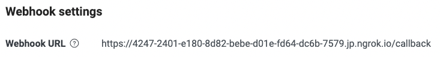

# LineBot
An easy linebot application work with SpringBoot, MongoDB and ngrok

## Table of Contents
* [General info](#general-info)
* [Technologies Used](#technologies-used)
* [How To Start](#how-to-start)
* [Demo](#demo)

## General info
這是一個具有基本回覆line訊息的linebot

## Technologies Used
Project is created with:
* Spring Boot version: 2.7.6
* ngrok
* MongoDB Altas

## How To Start
### 前置作業
1. 申請官方帳號：
   * 進入[LineDeveloper](https://developers.line.biz/zh-hant/)
   * 登入或申請帳號後創建Provider
   * 選擇選擇Create a line official account(choose Message API)

2. Clone該專案
   * ```git clone https://github.com/CoderLambTw/LineBot_Demo.git```

3. 設定linebot的channel-token及secret:
   * Channel secret 在 LINE Developers 的 Basic settings 內 
   * Channel access token 在 LINE Developers 的 Messaging API 的最底下
   * 取得後至專案中application.yml中進行修改

4. 安裝ngrok至本機
   * macOS User: 直接至終端機輸入 ```brew install --cask ngrok```即可完成安裝
   * windows User: 可至 [ngrok](https://ngrok.com/) 下載

### 啓動專案
1. Start spring boot application
2. Start ngrok(windows使用者需先自行啓動ngrok.exe):
   * 至終端機(command)輸入```ngrok http 9527```
   * 利用 ngrok 將本機Server (localhost) 發布到一個真實ip
   * 使User傳送的訊息可以透過此ip, 再透過Line bot傳送到我們的Server
   * 成功啓動後將 *Forwarding* 的 URL 複製 https://XXXXXXXX.ngrok.io 部分
   * 登入 [line developers tab](https://developers.line.biz/en/)，並選擇機器人
   * 進入messaging API後將複製ngrok URL貼到webhook中並於後方加上```/callback```
    
3. 按下webhookURL下方的Verify按鈕即可確認是否與本地server連通，如得到200的repsonse即可成功與機器人互動

## Demo
* [Demo Video](https://drive.google.com/file/d/1ed5j9mCkFIw9mRtFRVGzhaEgVjulPGme/view?usp=sharing)